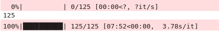

.. _example_basic_lite:

Basic Example Lite
==================

This example is the much condensed version of our basic example for those of us
already familiar with the parameters and how `LUCI` works. Let's get started!

Let's start with importing `LUCI`. Just as descsribed on the *readthedocs* page, we need to point our system path to our install location of the **LUCI** folder.
We will additionally import the Luci plotting functions :)

.. code-block:: python

    # Imports
    import sys
    sys.path.insert(0, '/media/carterrhea/carterrhea/SIGNALS/LUCI/')  # Location of Luci
    from LuciBase import Luci
    import LUCI.LuciPlotting as lplt

We now will set the required parameters. We are also going to be using our machine learning algorithm to get the initial guesses.

.. code-block:: python

    #Set Parameters
    # Using Machine Learning Algorithm for Initial Guess
    cube_dir = '/media/carterrhea/carterrhea/Benjamin'  # Path to data cube
    cube_name = 'A0426_SN3.merged.cm1.1.0'  # don't add .hdf5 extension
    object_name = 'NGC1275'
    redshift = 0.017284  # Redshift of NGC 1275
    ML_ref = '/media/carterrhea/carterrhea/SIGNALS/LUCI/ML/Reference-Spectrum-R1800'
    ML_model = '/media/carterrhea/carterrhea/SIGNALS/LUCI/ML/R1800-PREDICTOR-I'

We intialize our LUCI object

.. code-block:: python

    # Create Luci object
    cube = Luci(cube_dir+'/'+cube_name, cube_dir, object_name, redshift, ML_ref, ML_model)

The output will look something like this:

.. image:: ReadingIn.png
    :alt: Luci Initialization Output

Let's quickly create a deep frame

.. code-block:: python

    # Create Deep Image
    cube.create_deep_image()

We now fit part of our cube defined by the bounding box 1000<x<1500 and 250<y<750 with a Gaussian on the Halpha line, the NII-doublet, and the SII-doublet with a binning of 4.
We are also going to constrain our velocities and sigmas.

.. code-block:: python

    # Fit!
    vel_map, broad_map, flux_map, chi2_fits = cube.fit_cube(['Halpha', 'NII6548', 'NII6583', 'SII6716', 'SII6731'], 'gaussian', [1,1,1,1,1], [1,1,1,1,1], 1000, 1500, 250, 750, binning=4)

The output should look something like this:

Let's take a look at the velocity map. We can play with the colorbar limits with the `clims` argument.

.. code-block:: python

    lplt.plot_map(vel_map, 'velocity', cube_dir, clims=[-300,500])

And let's see what this looks like!

.. image:: VelocityMap.png
    :alt: Velocity Map
