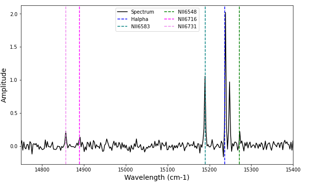

.. _example_double_fit:

Fitting Double Components
=========================

Sometimes a emission line is categorized by more than a single line of site emission feature. In this example,
we are going to create two Halpha components (and the other usual emission lines in SN3). We will then
fit the double components and the other lines.

Let's start of with the usual slew of commands.

.. code-block:: python

    # Imports
    import sys
    sys.path.insert(0, '/media/carterrhea/carterrhea/SIGNALS/LUCI/')  # Location of Luci
    from LUCI.LuciSim import Spectrum
    import matplotlib.pyplot as plt
    from astropy.io import fits
    import numpy as np
    import LUCI.LuciFit as lfit
    import keras

We now will set the required parameters. You can find a more detailed discussion on how to
create synthetic spectra in the example on synthetic spectra!

Let's first create the single component spectrum

.. code-block:: python

  lines = ['Halpha', 'NII6583', 'NII6548', 'SII6716', 'SII6731']
  fit_function = 'sincgauss'
  ampls = [10, 1, 1, 0.5, 0.45]  # Just randomly choosing these
  velocity = 0  # km/s
  broadening = 10  # km/s
  filter_ = 'SN3'
  resolution = 5000
  snr = 100

.. code-block:: python

  spectrum_axis, spectrum = Spectrum(lines, fit_function, ampls, velocity, broadening, filter_, resolution, snr).create_spectrum()

Now we can add another Halpha line :) To do this, we just need to add an additional line,
an additional amplitude, and a different velocity.

.. code-block:: python

  lines = ['Halpha']
  ampls = [6]  # Just randomly chosen
  velocity = 50  # km/s

  spectrum_axis2, spectrum2 = Spectrum(lines, fit_function, ampls, velocity, broadening, filter_, resolution, snr).create_spectrum()

  # Add them together
  spectrum += spectrum2

Now we can go about fitting this spectrum. To do this, we have to do the interpolation on the reference spectrum used for our machine learning algorithm manually.
Please note that this is all done internally in LUCI normally.

.. code-block:: python

  # Machine Learning Reference Spectrum
  ref_spec = fits.open('/media/carterrhea/carterrhea/SIGNALS/LUCI/ML/Reference-Spectrum-R5000-SN3.fits')[1].data
  channel = []
  counts = []
  for chan in ref_spec:  # Only want SN3 region
    channel.append(chan[0])
    counts.append(np.real(chan[1]))
  min_ = np.argmin(np.abs(np.array(channel)-14700))
  max_ = np.argmin(np.abs(np.array(channel)-15600))
  wavenumbers_syn = channel[min_:max_]
  f = interpolate.interp1d(spectrum_axis, spectrum, kind='slinear')
  sky_corr = (f(wavenumbers_syn))
  sky_corr_scale = np.max(sky_corr)
  sky_corr = sky_corr/sky_corr_scale

Let's plot this

.. code-block:: python

    plt.figure(figsize=(10,6))
    plt.plot(spectrum_axis, spectrum, color='black', label='Spectrum')
    plt.xlim(14750, 15400)
    plt.xlabel('Wavelength (cm-1)', fontsize=14)
    plt.ylabel('Amplitude', fontsize=14)
    plt.axvline(1e7/656.3, label='Halpha', color='blue', linestyle='--')
    plt.axvline(1e7/658.3, label='NII6583', color='teal', linestyle='--')
    plt.axvline(1e7/654.8, label='NII6548', color='green', linestyle='--')
    plt.axvline(1e7/671.6, label='NII6716', color='magenta', linestyle='--')
    plt.axvline(1e7/673.1, label='NII6731', color='violet', linestyle='--')
    plt.legend(ncol=2)
    plt.show()

We can now fit the spectrum

.. code-block:: python

  fit = lfit.Fit(spectrum, spectrum_axis, wavenumbers_syn, 'sincgauss',
                 ['Halpha', 'NII6583', 'NII6548','SII6716', 'SII6731', 'Halpha'],
                 [1,1,1,1,1,2], [1,1,1,1,1,2],
                 keras.models.load_model('/media/carterrhea/carterrhea/SIGNALS/LUCI/ML/R5000-PREDICTOR-I-SN3')
               )
  fit_dict = fit.fit()

And let's visualize that fit..

.. code-block:: python

    plt.plot(spectrum_axis, spectrum, label='spectrum')
    plt.plot(spectrum_axis, fit_dict['fit_vector'], label='fit vector', linestyle='--')
    plt.xlim(14800, 15300)
    plt.legend()

.. image:: DoubleFit.png
    :alt: Double component Halpha fit