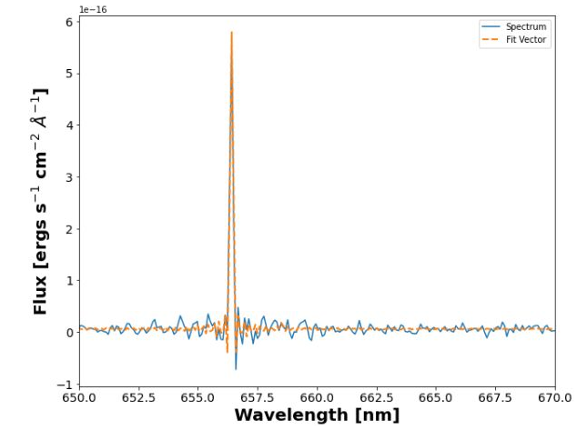

.. _example_basic:

Fit Pixel
=============

In this notebook we will fit a single pixel in a data cube for M33 Field 7 SN3.

We should start by import the appropriate modules.

.. code-block:: python

    import os

    import numpy as np
    import matplotlib.pyplot as plt

    # Get location of LUCI

    from luci import SitelleCube
    import luci.viz.plotting as lplt
    %config Completer.use_jedi=False  # enable autocompletion when typing in Jupyter notebooks

For example:

.. code-block:: python

    # Initialize paths and set parameters
    cube_dir = '/export/home/carterrhea/M33'  # Path to data cube
    #cube_dir = '/mnt/carterrhea/carterrhea/NGC628'  # Full path to data cube (example 2)
    cube_name = 'M33_SN3'  # don't add .hdf5 extension
    object_name = 'M33'
    filter_name = 'SN3'
    redshift = -0.0006  # Redshift of object
    resolution = 5000

With these parameters set, we can invoke `LUCI` with the following command:

.. code-block:: python

    cube = SitelleCube(cube_path=cube_dir+'/'+cube_name, output_dir=cube_dir,
                       object_name=object_name, redshift=redshift, resolution=resolution, ML_bool=ML_bool)

Now we should get our background region.

.. code-block:: python

    # We use 'mean = True' to take the mean of the emission in the region instead of the sum
    bkg_axis, bkg_sky = cube.extract_spectrum_region('regions/bkg_M33.reg', mean=True)
    lplt.plot_spectrum(bkg_axis, bkg_sky)

We will now fit a single pixel and take a look at the fit. This fit commands has all the same options as all the other commands except for binning :)

.. code-block:: python

    axis, sky, fit_dict = cube.fit_pixel(
        ['Halpha', 'NII6548', 'NII6583'],  # lines
        'sincgauss',   # fit function
        [1,1,1],  # velocity relationship
        [1,1,1],  # sigma relationship
        1265, 1789,    # x & y coordinate
        binning=1,  # Set binnning around coordinate -- this will just fit the one pixel
        bkg=bkg_sky,  # Set background
    )

We can plot the fit with the following:

.. code-block:: python

    lplt.plot_fit(axis, sky, fit_dict['fit_vector'], units='nm')
    plt.xlim(650, 670)
    

